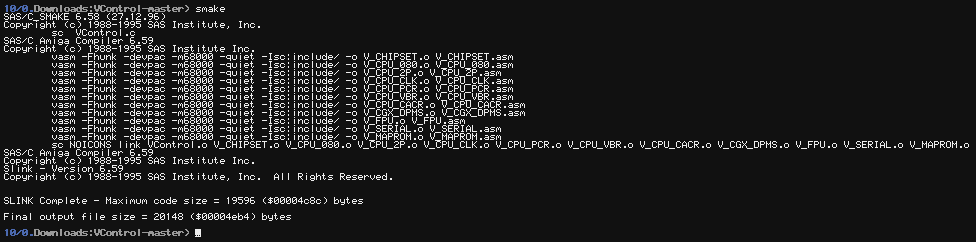
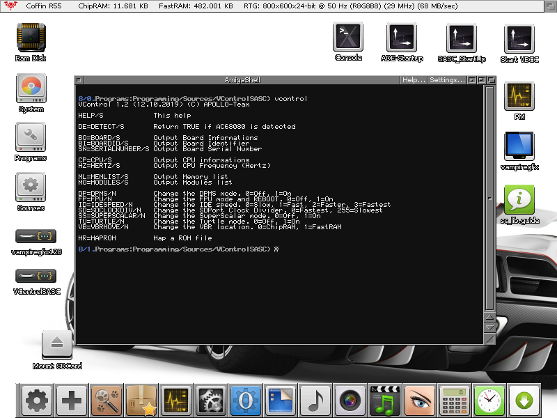
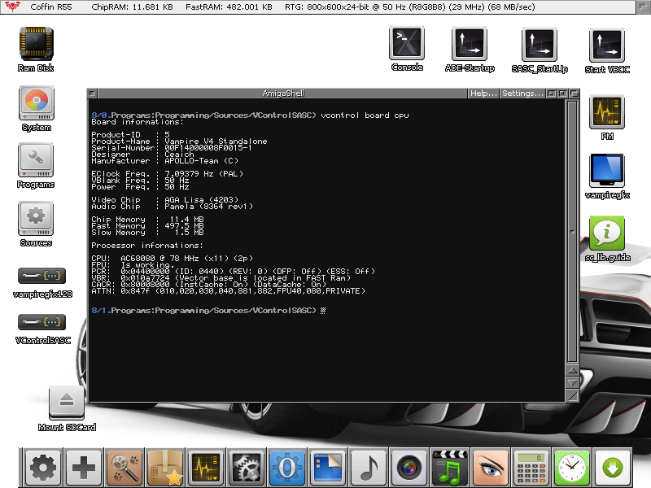

# VControl

(C) Copyright 2016-2020 APOLLO-Team

The purpose of `VControl` is to bring some valuable informations and controls over the `Vampire` boards.

# Releases

VControl 1.15 (1.6.2020)

Latest official binary releases : [Download](https://www.apollo-accelerators.com/wiki/doku.php/saga:updates)

# Features

Latest official documentation : [Open](DOCUMENTATION.md#documentation)

Command | Description
------------ | -------------
HELP/S | This help
DE=DETECT/S | Return AC68080 detection is $RC
BO=BOARD/S | Output Board Informations
BI=BOARDID/S | Output Board Identifier
BN=BOARDNAME/S | Output Board Name
SN=BOARDSERIAL/S | Output Board Serial Number
CO=CORE/S | Output Core Revision String
CR=COREREV/S | Output Core Revision Number
CP=CPU/S | Output CPU informations
HZ=HERTZ/S | Output CPU Frequency (Hertz)
ML=MEMLIST/S | Output Memory list
MO=MODULES/S | Output Modules list
SE=SETENV/S | Create Environment Variables
AF=ATTNFLAGS/S | Change the AttnFlags (Force 080's)
AK=AKIKO/S | Change the GfxBase->ChunkyToPlanarPtr()
DP=DPMS/N | Change the DPMS mode. 0=Off, 1=On
FP=FPU/N | Change the FPU mode. 0=Off, 1=On
ID=IDESPEED/N | Change the IDE speed. 0=Slow, 1=Fast, 2=Faster, 3=Fastest
SD=SDCLOCKDIV/N | Change the SDPort Clock Divider. 0=Fastest, 255=Slowest
SS=SUPERSCALAR/N | Change the SuperScalar mode. 0=Off, 1=On
TU=TURTLE/N | Change the Turtle mode. 0=Off, 1=On
VB=VBRMOVE/N | Change the VBR location. 0=ChipRAM, 1=FastRAM
MR=MAPROM | Map a ROM file

# Build instructions

To compile `VControl` you need :

* `SAS/C` 6.59 for CBM AmigaOS3 M68K

* `VASM` 1.8h for CBM AmigaOS3 M68K [Download](http://sun.hasenbraten.de/vasm/bin/rel/vasmm68k_mot_os3.lha)

* Use the provided `smakefile`.

* `CD` to the project and type `smake`.

# Screenshots

